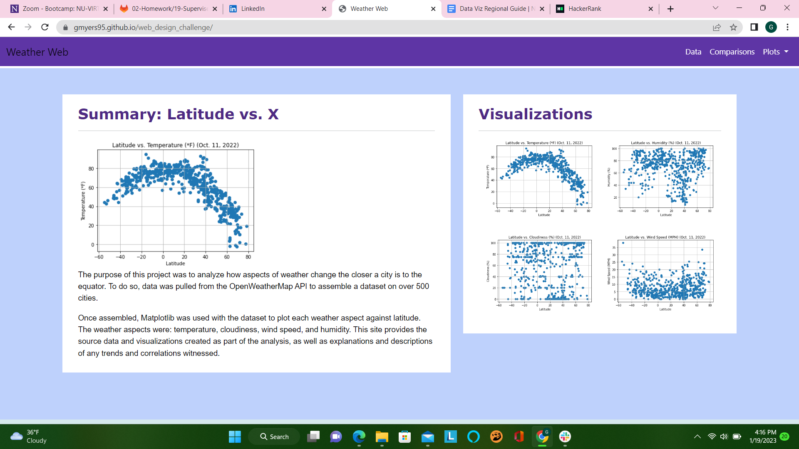

# web_design_challenge
[Welcome to my Weather Web](https://gmyers95.github.io/web_design_challenge/)

## Overview

Using Bootstrap with images that were created in Python from a previous [data analysis](https://github.com/GMyers95/api_challenge) to develop a live page.  The goal of the challenge was to create templates and generate pages with minimal time usage.

## Bootstrap Features:
* Responsive Menu, Layout, and Table
* Navbar
* CSS Hover Effects

 

## Technologies    
*  HTML/CSS/JS
*  Bootstrap4

 

## Setup and Installation  

1. Clone the repo to your local machine
1. Open repo folder in an IDE like VSCode
1. Using a virtual server like the VSCode extention LiveServer
1. Run `index.html`  

 
